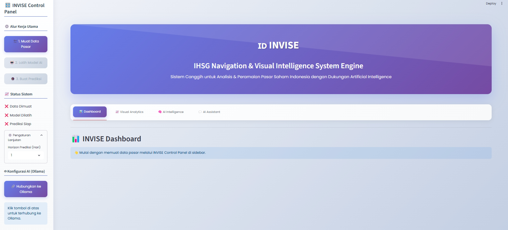

# INVISE: IHSG Navigation & Visual Intelligence System Engine


**INVISE** adalah sistem peramalan hibrida canggih yang dirancang untuk memberikan analisis waktu nyata dan wawasan prediktif terhadap Indeks Harga Saham Gabungan (IHSG). Sistem ini menggabungkan model machine learning kuantitatif dengan kemampuan penalaran dari Large Language Models (LLMs) untuk menjembatani data mentah dengan pengambilan keputusan strategis.

> Dikembangkan oleh **Tim Golden Delta** dari **Universitas Sanata Dharma** sebagai bagian dari kompetisi Datathon 2025 oleh RISTEK, Fakultas Ilmu Komputer, Universitas Indonesia.

---

## 🚀 Application Preview



---

## ✨ Main Features

- **Dashboard Prediksi Dinamis**  
  Visualisasi prediksi harga IHSG untuk beberapa hari ke depan, lengkap dengan arah pergerakan, estimasi persentase perubahan, dan tingkat kepercayaan model.

- **Analisis Pasar Multi-Aset**  
  Pantau kinerja aset global berpengaruh (S&P 500, Nikkei, Emas, Minyak, dll.) dan lihat korelasinya dengan IHSG.

- **AI Intelligence – Analisis Otomatis**  
  Terima laporan analisis pasar yang dihasilkan oleh AI, tersedia untuk dua audiens: investor institusional dan ritel, dalam bahasa Indonesia dan Inggris.

- **AI Assistant – Antarmuka Percakapan**  
  Interaksi langsung dengan asisten AI untuk menanyakan hal-hal spesifik terkait data, prediksi, atau istilah pasar. Dilengkapi fitur transparansi yang menampilkan "proses berpikir" AI.

- **Visualisasi Data Komprehensif**  
  Jelajahi data historis melalui grafik candlestick interaktif, visualisasi backtesting model, dan korelasi aset pada pelatihan model.

- **Alur Kerja Terpandu**  
  Antarmuka yang ramah pengguna memandu proses mulai dari memuat data, melatih model, hingga menghasilkan prediksi.

> ⚠️ Fitur yang menggunakan AI hanya tersedia di versi lokal karena keterbatasan hosting model Ollama.

---

## 🏗️ System Architecture

INVISE dibangun dengan arsitektur modular tiga lapis:

### 1. Presentation Layer (Streamlit)
Antarmuka pengguna interaktif yang menangani input dan menampilkan hasil analisis serta visualisasi.

### 2. Hybrid AI Engine (Backend Python)
- **Pipeline Prediksi Kuantitatif**: Proses rekayasa fitur, pelatihan model ensemble (XGBoost & LightGBM), dan strategi peramalan rekursif.
- **Lapisan Penalaran LLM**: Terhubung ke LLM lokal melalui Ollama untuk menghasilkan analisis naratif dan mendukung asisten percakapan.

### 3. Data Acquisition Layer (yfinance)
Menarik data time-series finansial terkini langsung dari Yahoo Finance.

---

## 🛠️ Technology Stack

- **Backend & Analisis Data**: Python 3.10  
- **Framework Web & Dashboard**: Streamlit  
- **Manipulasi Data**: Pandas, NumPy  
- **Machine Learning**: Scikit-learn, XGBoost, LightGBM  
- **Layanan LLM**: Ollama  
- **Pengambilan Data**: yfinance  
- **Visualisasi**: Plotly  

---

## ⚙️ Installation & Usage

### 1. Prasyarat
- Python versi 3.10 atau lebih baru
- [Ollama](https://ollama.com): Instal dan jalankan secara lokal

### 2. Instalasi Proyek

```bash
# Kloning repositori
git clone https://github.com/MaddMDR/INVISE-IHSG-Intelligence-Platform.git
cd INVISE-IHSG-Intelligence-Platform

# Buat dan aktifkan virtual environment
python -m venv venv
source venv/bin/activate   # Untuk Windows: venv\Scripts\activate

# Instal semua dependensi
pip install -r requirements.txt
```

### 3. Setup Model LLM

Setelah Ollama terinstal, buka PowerShell (atau terminal) dan jalankan perintah berikut untuk mengunduh model LLM yang diperlukan:

```bash
# Contoh menggunakan qwen2.5vl
ollama pull qwen2.5vl
```

> Anda bisa mengganti `qwen2.5vl` dengan model lain seperti `llama3` atau `mistral`.

### 4. Running the application

Setelah semua dependensi terinstal dan model LLM dari Ollama sudah tersedia, jalankan aplikasi Streamlit dengan perintah berikut:

```bash
streamlit run app.py
```

Lalu buka browser Anda dan kunjungi: [http://localhost:8501](http://localhost:8501)

---

## 🗂️ Project Folder Structure

```
INVISE-IHSG-Intelligence-Platform/
├── app.py               # File utama aplikasi Streamlit
├── ollama_chat.py       # Kelas untuk interaksi dengan Ollama
├── ihsg_platform.py     # Pipeline data & model ML
├── chart_utils.py       # Fungsi visualisasi
├── css.py               # Gaya CSS khusus
├── requirements.txt     # Daftar dependensi Python
└── README.md            # Dokumentasi proyek
```

---

## 📖 How-to use

1. **Muat Data Pasar**  
   Klik tombol "1. Load Market Data" di sidebar untuk mengambil data pasar terbaru.

2. **Latih Model AI**  
   Setelah data berhasil dimuat, tombol "2. Train AI Model" akan aktif. Klik untuk melatih model XGBoost dan LightGBM.

3. **Hasilkan Prediksi**  
   Klik "3. Generate Prediction" untuk menghasilkan prediksi IHSG.

4. **Eksplorasi Hasil**  
   - Tab *Dashboard* untuk melihat hasil utama
   - Tab *Visual Intelligence* untuk melihat beberapa visualisasi teknikal data dan backtesting model   
   - Tab *AI Intelligence* untuk analisis naratif dengan bantuan AI 
   - Tab *AI Assistant* untuk tanya jawab seputar informasi peramalan

---

## 🤝 Contribution

Kami menyambut kontribusi! Silakan fork repositori ini dan ajukan *pull request*. Untuk ide besar, buat *issue* terlebih dahulu agar bisa didiskusikan bersama.

---

## 📄 License

This project is licensed under the [MIT License](./LICENSE.md).
---

## 🙏 Acknowledgments

Terima kasih kepada komunitas open-source atas pustaka dan alat luar biasa yang memungkinkan proyek ini terwujud.
